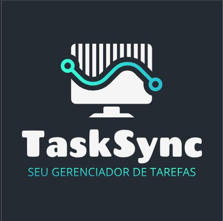

# TaskSync

## *Sistema de Gerenciamento de Tarefas estilo Kanban*

**Gerencie suas tarefas com eficiência e simplicidade**

---

## Sobre o Projeto

A **TaskSync Solutions** é uma empresa fictícia especializada em consultoria e execução de projetos corporativos. Este sistema foi desenvolvido para substituir os quadros físicos de kanban por uma solução digital moderna, permitindo maior visibilidade, organização e integração entre os setores.

### Objetivo

Desenvolver uma aplicação que permita:

- Cadastro de usuários
- Cadastro e edição de tarefas vinculadas a usuários
- Visualização de tarefas organizadas por status (Kanban)
- Atualização e exclusão de tarefas
- Interface responsiva e de fácil navegação

### Status das Tarefas

| Status || Descrição |
|--------|-------|-----------|
| A Fazer || Tarefas aguardando início |
| Fazendo || Tarefas em andamento |
| Concluído || Tarefas finalizadas |

---

## Tecnologias Utilizadas

<b>Clique para ver detalhes</b>

| Camada | Tecnologia | Versão |
|--------|------------|--------|
| **Front-end** | HTML5, CSS3, JavaScript | - |
| **Back-end** | PHP | 7.4+ |
| **Banco de Dados** | MySQL | 8.0+ |
| **Gerenciador DB** | phpMyAdmin | 5.0+ |
| **Servidor Local** | Apache (XAMPP) | 3.3+ |

# Você precisa ter instalado:
- XAMPP (Apache + MySQL)
- Navegador web moderno
- Git

# INFORMAÇÕES NECESSÁRIAS PARA ACESSAR O SITE:

- Você pode criar uma conta e você mesmo usufluir o site, mas caso queira ver com registros:
- EMAIL: jamyfranquilim@gmail.com SENHA: 123456
